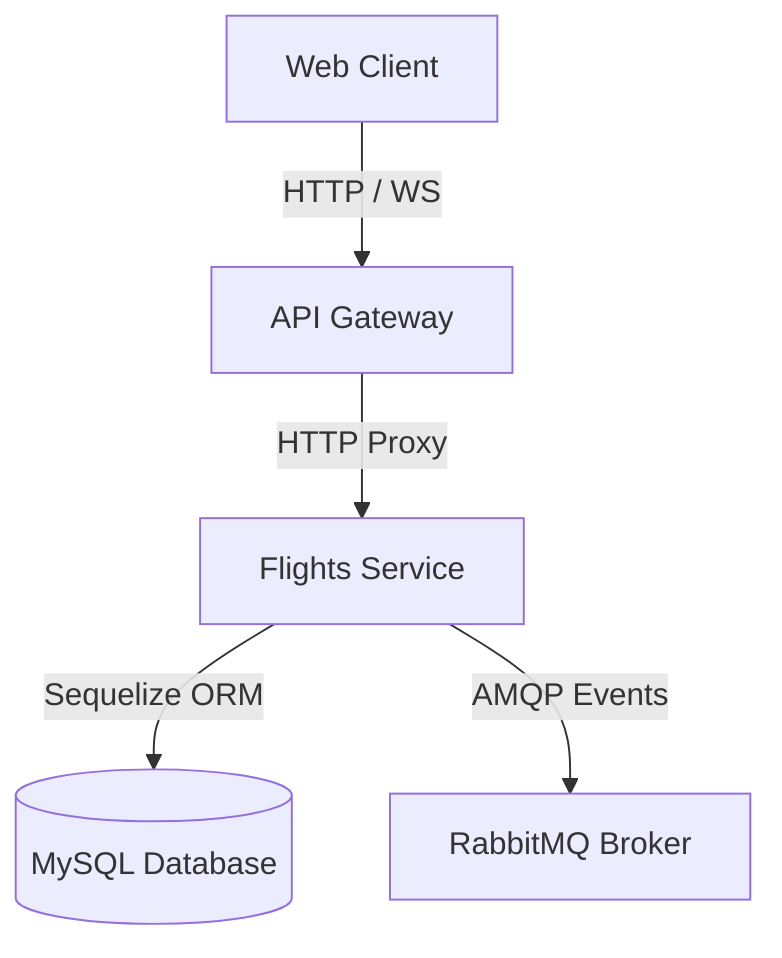
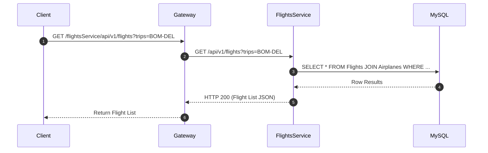
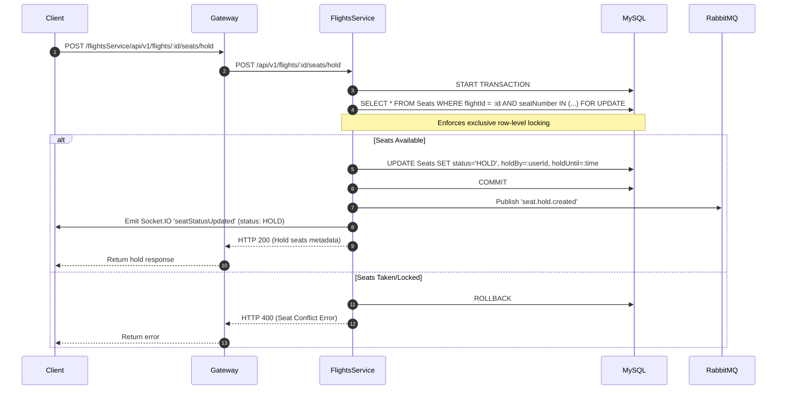
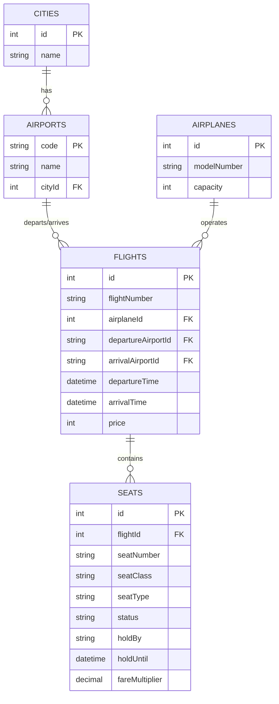

# Flights Service

## 1. Service Overview
The **Flights Service** is the central authority for resource scheduling and physical seat mappings within the Booking Mafia microservices ecosystem. It owns and manages the lifecycle of **Cities, Airports, Airplanes, Flights, and Seats**.

### Business Responsibilities
- **Flight Scheduling**: Creating and querying flight schedules including departure/arrival timings, pricing, and gates.
- **Seat Mapping Ownership**: Generating the physical cabin seat map dynamically upon flight creation based on the associated airplane capacity.
- **Seat Allocation & Locking**: Performing safe holds, transactional confirmations, and releases on individual seats (e.g., 12A, 15F) using row-level locking.
- **Real-time Synchronization**: Running an internal chronometer to release holds after expiration and broadcasting live seat changes via WebSockets (Socket.IO).

---

## 2. Folder Structure
```
Flights/
├── src/
│   ├── config/             # DB & Queue connection initializations
│   ├── controllers/        # Express HTTP endpoint controllers
│   ├── migrations/         # Sequelize database DDL schema definitions
│   ├── models/             # Sequelize ORM schema entities & associations
│   ├── repositories/       # Core database queries (CRUD pattern)
│   ├── routes/             # Route maps for v1 endpoints
│   ├── seeders/            # Database initial data seeds
│   ├── services/           # Business domain logic (seat maps, holds)
│   └── utils/
│       ├── common/         # Cron schedulers, Socket.io emitter singletons
│       └── errors/         # Custom AppError classifications
```
### Folder Responsibilities
- **`config/`**: Sets up ports and connections to MySQL and RabbitMQ.
- **`controllers/`**: Deserializes requests, validates user inputs, invokes services, and sends unified JSON HTTP responses.
- **`services/`**: Orchestrates transactions, evaluates seat pricing adjustments, and coordinates database operations.
- **`repositories/`**: Decouples Sequelize queries from the business layer using a generic repository pattern.
- **`utils/common/cron-jobs.js`**: Reclaims expired seat holds periodically and dispatches release events.
- **`utils/common/socket-emitter.js`**: Singleton WebSocket broker transmitting seat status changes to the frontend.

---

## 3. Architecture Diagram


---

## 4. Sequence Diagrams

### Search Flight


### Seat Hold


---

## 5. API Documentation

### GET /api/v1/flights
- **Description**: Query scheduled flights based on search criteria.
- **Headers**: None
- **Query Params**:
  - `trips` (optional): Route code (e.g., `DEP-ARR`)
  - `tripDate` (optional): Date string (`YYYY-MM-DD`)
  - `price` (optional): Range filter (`0-500`)
  - `sort` (optional): Criteria (`price_ASC`, `departureTime_DESC`)
- **Success Response (200)**:
  ```json
  {
    "success": true,
    "message": "Successfully fetched all flights",
    "data": [
      {
        "id": 1,
        "flightNumber": "TEST-17195000000",
        "price": 250,
        "departureAirportId": "DEP",
        "arrivalAirportId": "ARR"
      }
    ],
    "error": {}
  }
  ```

### GET /api/v1/flights/:id/seats
- **Description**: Fetch all generated seat records and their availability statuses for a flight.
- **Success Response (200)**:
  ```json
  {
    "success": true,
    "message": "Successfully fetched seats for the flight",
    "data": [
      {
        "id": 120,
        "seatNumber": "12A",
        "seatClass": "ECONOMY",
        "seatType": "WINDOW",
        "status": "AVAILABLE",
        "fareMultiplier": "1.10"
      }
    ]
  }
  ```

### POST /api/v1/flights/:id/seats/hold
- **Description**: Restrict a set of seats temporarily (2 minutes limit) for checkout.
- **Authentication**: JWT Required
- **Request Body**:
  ```json
  {
    "seatNumbers": ["12A", "12B"],
    "holdBy": "5"
  }
  ```
- **Success Response (200)**:
  ```json
  {
    "success": true,
    "data": [
      {
        "seatNumber": "12A",
        "status": "HOLD",
        "holdUntil": "2026-06-27T16:32:00.000Z"
      }
    ]
  }
  ```

---

## 6. Database Schema

### Database Pricing Multipliers
- **Seat Class**: BUSINESS = 2.0x, PREMIUM_ECONOMY = 1.3x, ECONOMY = 1.0x.
- **Seat Type Adjustments**: WINDOW (Cols A, F) = +0.10, AISLE (Cols C, D) = +0.05.
- **Exit Row Override**: Row 5 receives `EXTRA_LEG_ROOM` = +0.20 (which overrides window/aisle adjustments).

---

## 7. Service Communication
- **REST APIs**: Receives synchronous requests from the Booking Service during creation, cancellation, and payment confirmation.
- **RabbitMQ events**:
  - Emits `seat.hold.created` on booking holds.
  - Emits `seat.hold.expired` on hold timeouts.
  - Emits `seat.booked` on ticket completion.
  - Emits `seat.released` on checkout cancellations.
- **Socket.IO (WS)**: Broadcasts `seatStatusUpdated` directly to connected clients in real-time flight rooms.

---

## 8. Docker Documentation
- **Build Command**:
  ```bash
  docker build -t bookingmafia/flights-service:latest .
  ```
- **Ports**: Exposes port `3000`.
- **Environment Variables**:
  - `PORT=3000`
  - `DB_HOST=mysql-db`
  - `RABBITMQ_URL=amqp://rabbitmq-broker:5672`

---

## 9. Kubernetes Documentation
Managed under `Flights` K8s deployment manifests:
- **Deployment**: Runs a stateless container replica set with resources throttled to `250m` CPU and `512Mi` Memory.
- **Service**: Exposes port `3000` inside the cluster namespaces.
- **ConfigMap**: Holds system configurations (e.g. Database host links, RabbitMQ urls).

---

## 10. Environment Variables
See `.env.example`:
```ini
PORT=3000
DB_HOST=127.0.0.1
DB_USER=root
DB_PASS=password
DB_NAME=Flights
RABBITMQ_URL=amqp://localhost
```

---

## 11. Error Handling Strategy
- Uses a centralized middleware catching `AppError` exceptions.
- Converts Sequelize constraint violations (e.g., uniqueness issues on seats) to HTTP 400 Bad Request responses.
- Implements transaction rolls on query exceptions to preserve atomic database state.

---

## 12. Logging Strategy
- Utilizes Winston logger format configurations.
- Categorizes outputs to `info.log` for route calls and `error.log` for database rollback transactions.

---

## 13. Scaling Strategy
- **Horizontal Scaling**: Stateless design allows running multiple pods behind Kubernetes services.
- **WebSocket Clustering**: Employs a Socket.IO Redis adapter to distribute seat broadcast updates across pod replicas safely.
- **Read Replicas**: Directs listing queries to read replicas while transactions target the master DB node.

---

## 14. Security
- API Gateway executes authentication filters before routing proxy triggers.
- Restricts SQL Injection vectors using parameter bindings inside Sequelize ORM.

---

## 15. Future Improvements
- **Redis Cache**: Store generated seat layouts in Redis memory cache to speed up lists under massive traffic queries.
- **Autoscaling Policies**: Trigger replica scaling based on real-time flight scheduling query load.